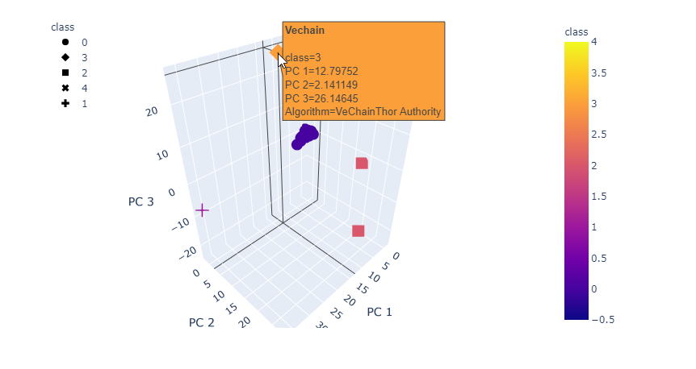
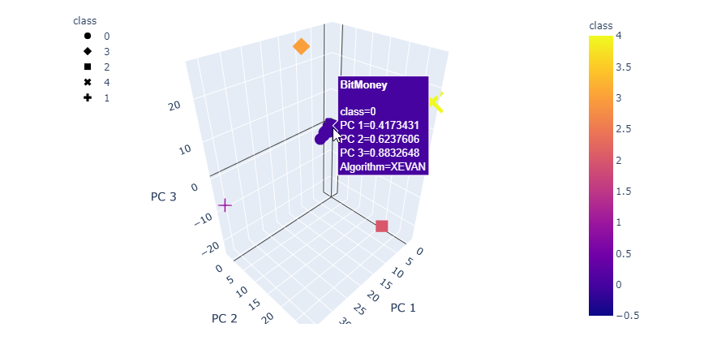

# Cryptocurrencies

**Summary**

the immense universe of cryptocurrencies on the trading market and how cryptocurrencies could be grouped toward creating a classification for developing this new investment product.

**Objectives**

1. Prepare the data for dimensions reduction with PCA and clustering using K-means.
2. Reduce data dimensions using PCA algorithms from sklearn.
3. Predict clusters using cryptocurrencies data using the K-means algorithm form sklearn.
4. Create some plots and data tables to present your results.

**Source Codes**

1. [Crypto_Currency.ipynb](Crypto_Currency.ipynb)
2. [crypto_data.csv](crypto_data.csv)

**5 Clusters**

PCA (Principal Component Analysis): The cryptocurrencies are very similar to each other so we picked 2 components to view clusters on 3D graph. With the best K-mean 5 cluster, we can view seperate cluster clearly.

**Conclusion**

Some cryptocurrencies standout from the cluster groups. We need to do more research to find out the popularity, infrastructure, security of each clusters before making the decision on a new investment product. However, this analysis gives a great picture of the classification of the cryptocurrencies on the trading market.
